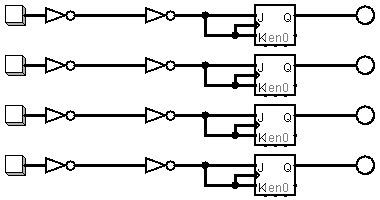

# SwitchBank eXPerience

SwitchBank eXPerience is a home project for a simple classification and implementation of switch-bank circuits.  
Schematics and PCB layouts are designed with ExpressPCB free CAD and Logisim tool software.

For this experience are considered only ***momentary switch***,
in which the operable status (contact) is maintained only while the actuating force is applyed (the switch is depressed).

### Switch-Bank

A switch-bank is a set of related switches (only momentary switch are considered in this eXPerience), organized as an *array* or a *matrix* (shaped as an array of switch-array elements).
The type of relationship between switches within a bank can be listed by the following ***relationship types***:

- ***mutually-inclusive (i)*** when more than one switch can be operable at the same time.
- ***mutually-exclusive (x)*** when only one switch per time can be operable.

The type of action of the switches within the bank determines the following ***action modes***:

- ***momentary switch-bank (mo)*** A switch-bank in witch the operable status of the inside switches is maintained only while the switches are depressed.
- ***maintained switch-bank (ma)*** A switch-bank in witch the operable status of the inside switches is maintained after releasing the switches.
- ***alternate switch-bank (al)*** A maintained switch-bank in which the operational status is toggle between successive depress/release action on the same switches.

The mix of all relationship types and action modes determines the following ***operational modes***:

- ***momentary mutually-inclusive switch-bank*** (as a polyphonic keyboard)
> 
- ***alternated mutually-inclusive switch-bank*** (as a toggle-button bank)
> 
- ***momentary mutually-exclusive switch-bank*** (as a monophonic keyboard)
> ...
- ***maintained mutually-exclusive switch-bank*** or ***selector*** (as a monophonic keyboard with sustain)
> 
- ***alternated mutually-exclusive switch-bank***
> 

## Changes
See file [CHANGES](CHANGES) for the project resources change logs.

## About
Author : Alessandro Fraschetti (mail: [gos95@gommagomma.net](mailto:gos95@gommagomma.net))

## License
This project is licensed under the [Creative Commons BY-SA 3.0](http://creativecommons.org/licenses/by-sa/3.0/) License.